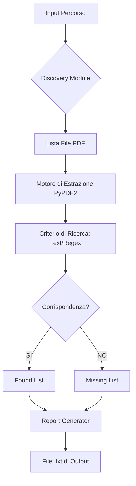

# 📄 PDF Search Enterprise: Regex & Text Miner


## 🚀 Analisi Documentale Massiva alla Velocità della Luce

**PDF Search Enterprise** è uno strumento di livello professionale progettato per l'estrazione e la ricerca mirata di informazioni all'interno di grandi volumi di documenti PDF. Che tu stia cercando una clausola specifica in migliaia di contratti o analizzando dataset testuali per ricerca accademica, questo tool offre una precisione chirurgica grazie al supporto nativo per le **Espressioni Regolari (REGEX)**.

Costruito con un'architettura robusta e resiliente, il sistema gestisce in modo intelligente gli errori di lettura dei metadati e dei blocchi di testo, garantendo che l'analisi non si interrompa mai. L'interfaccia, potenziata dalla libreria `Rich`, trasforma il terminale in una dashboard operativa moderna con feedback in tempo reale e reportistica automatizzata.

---

## 📌 Indice
* [✨ Caratteristiche Principali](#-caratteristiche-principali)
* [🏗️ Architettura del Sistema](#-architettura-del-sistema)
* [📂 Struttura della Repository](#-struttura-della-repository)
* [⚙️ Installazione](#-installazione)
* [🛠️ Guida all'Uso](#-guida-alluso)
* [🖼️ Media e Interfaccia](#-media-e-interfaccia)
* [🗺️ Roadmap](#-roadmap)
* [❓ FAQ](#-faq)
* [🤝 Contribuire](#-contribuire)

---

## ✨ Caratteristiche Principali
* **🔍 Ricerca Ibrida**: Supporto per stringhe semplici (case-insensitive) e pattern REGEX complessi.
* **📂 Scansione Ricorsiva**: Identificazione automatica di tutti i PDF in una directory e nelle relative sottocartelle.
* **🛡️ Estrazione Resiliente**: Gestione sicura dei PDF corrotti o con pagine non leggibili tramite logging granulare.
* **📊 Reportistica Automatica**: Generazione istantanea di file `.txt` con i percorsi assoluti dei file trovati e mancanti.
* **⚡ UX Moderna**: Barra di progresso dinamica, tabelle di riepilogo e messaggistica a colori nel terminale.

---

## 🏗️ Architettura del Sistema



---

## 📂 Struttura della Repository
```text
.
├── main.py              # Logica di business e interfaccia CLI
├── custom_logger.py     # Modulo per la diagnostica aziendale
├── requirements.txt     # Dipendenze: PyPDF2, Rich
└── logs/                # Directory dei log di sistema (generata)
```

---

## ⚙️ Installazione

1. **Clona la repository**:
   ```bash
   git clone https://github.com/mattemn97/pdf-search-enterprise.git
   cd pdf-search-enterprise
   ```

2. **Crea un ambiente virtuale**:
   ```bash
   python -m venv venv
   source venv/bin/activate  # Windows: venv\Scripts\activate
   ```

3. **Installa le dipendenze**:
   ```bash
   pip install -r requirements.txt
   ```

---

## 🛠️ Guida all'Uso

Avvia lo strumento dal terminale:

```bash
python main.py
```

### Esempi di Ricerca:
* **Testo Semplice**: Digita `Fattura` per trovare tutti i documenti che contengono questa parola.
* **REGEX**: Utilizza `^IT\d{2}[A-Z]\d{22}$` per trovare documenti che contengono un codice IBAN italiano.

> [!TIP]
> Al termine del processo, consulta i file `documenti_con_corrispondenza.txt` e `documenti_senza_corrispondenza.txt` per l'elenco completo dei risultati.

---

## 🖼️ Media e Interfaccia

| Stadio | Descrizione Visiva |
| :--- | :--- |
| **Configurazione** |  |
| **Analisi** |  |

---

## 🗺️ Roadmap
- [ ] **OCR Integration**: Supporto per la lettura di PDF scannerizzati (tramite Tesseract).
- [ ] **Esportazione Excel**: Generazione report in formato `.xlsx` con anteprima del testo trovato.
- [ ] **Multithreading**: Velocizzazione dell'estrazione su grandi dataset tramite CPU multi-core.
- [ ] **Web UI**: Sviluppo di una dashboard leggera con Streamlit.

---

## ❓ FAQ

**Q: Il tool può leggere PDF protetti da password?**
**A:** Attualmente no. Se il file è criptato, il logger registrerà un errore e passerà al file successivo della coda.

**Q: Funziona su sistemi Windows e Linux?**
**A:** Certamente. Utilizziamo `pathlib` per garantire la compatibilità dei percorsi dei file su qualsiasi sistema operativo.

---

## 🤝 Contribuire
Siamo aperti a contributi! Se desideri migliorare il motore di ricerca o aggiungere nuove funzionalità:
1. Apri una issue per discutere l'idea.
2. Invia una Pull Request seguendo lo stile di codifica definito in `main.py`.

---

## 📄 Licenza
Distribuito sotto Licenza MIT.

---

## 🌟 Credits
* **PyPDF2**: Per la manipolazione dei file PDF.
* **Rich**: Per l'eccezionale interfaccia a riga di comando.

---

## 📨 Contatti
**Sviluppatore**: mattemn97  
**GitHub**: [https://github.com/mattemn97](https://github.com/mattemn97)

`python` `pdf-mining` `regex` `data-extraction` `cli` `automation` `pypdf2` `rich-library` `document-analysis` `search-engine` `enterprise-tools` `open-source`
